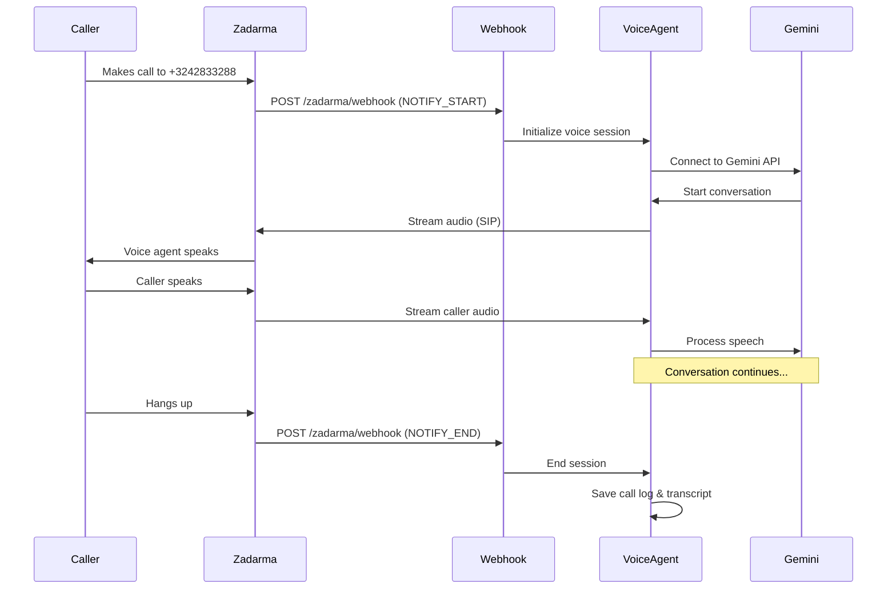

# Zadarma Integration Setup Guide

This guide explains how to integrate Zadarma telephony services with your WeeVoice platform to enable voice agents to handle real phone calls.

## Table of Contents
1. [Overview](#overview)
2. [Prerequisites](#prerequisites)
3. [Configuration](#configuration)
4. [Webhook Setup](#webhook-setup)
5. [Testing](#testing)
6. [Troubleshooting](#troubleshooting)

## Overview

Zadarma provides:
- **Phone Numbers**: International phone numbers for your voice agents
- **SIP Connection**: Direct SIP connection for call handling
- **API Integration**: RESTful API for number management and call control
- **Webhooks**: Real-time notifications for incoming calls and events

## Prerequisites

1. **Zadarma Account**: Sign up at [zadarma.com](https://zadarma.com)
2. **Phone Number**: Purchase or configure a phone number
3. **API Credentials**: Generate API key and secret from your Zadarma dashboard
4. **SIP Credentials**: Available in your Zadarma account settings

## Configuration

### Step 1: Create Environment File

Create a `.env` file in the `backend` directory with your Zadarma credentials:

```bash
# Copy the example file
cp .env.example .env
```

### Step 2: Add Zadarma Credentials

Edit the `.env` file and add your Zadarma credentials:

```bash
# Zadarma API Credentials
# Used for phone number management, call control, and API operations
ZADARMA_API_KEY=your_api_key_from_zadarma_dashboard
ZADARMA_API_SECRET=your_api_secret_from_zadarma_dashboard

# Zadarma SIP Credentials
# Used for direct SIP connection (optional, for advanced use cases)
ZADARMA_SIP_SERVER=sip.zadarma.com
ZADARMA_SIP_LOGIN=your_sip_login
ZADARMA_SIP_PASSWORD=your_sip_password
ZADARMA_PHONE_NUMBER=your_phone_number_with_country_code
```

### Example Configuration

Based on your Zadarma account:

```bash
# API Credentials
ZADARMA_API_KEY=xxxxxxxxxx
ZADARMA_API_SECRET=xxxxxxxxxxx

# SIP Connection Settings
ZADARMA_SIP_SERVER=sip.zadarma.com
ZADARMA_SIP_LOGIN=667776
ZADARMA_SIP_PASSWORD=gVZaJZ
ZADARMA_PHONE_NUMBER=+3242833288
```

⚠️ **Security Note**: Never commit the `.env` file to version control. It's already in `.gitignore`.

## Webhook Setup

Zadarma uses webhooks to notify your application about incoming calls and call events. You need to configure the webhook URL in your Zadarma dashboard.

### Step 1: Configure Public URL

Your backend needs to be accessible from the internet. For development:

**Option A: Using ngrok (recommended for testing)**
```bash
# Install ngrok
# Download from https://ngrok.com/

# Start your backend
cd backend
python -m uvicorn app.main:app --host 0.0.0.0 --port 8000

# In another terminal, expose it
ngrok http 8000

# You'll get a URL like: https://abc123.ngrok.io
```

**Option B: Deploy to production server**
- Deploy your backend to a server with a public IP
- Use your domain: `https://yourdomain.com`

### Step 2: Configure Webhook in Zadarma

1. Log into your [Zadarma Dashboard](https://my.zadarma.com/)
2. Go to **Settings** → **API & Webhooks**
3. Configure the webhook URL:

```
Webhook URL: https://your-domain.com/api/v1/zadarma/webhook
Method: POST
Events: Select all call-related events
```

### Step 3: Webhook Events

The system handles these Zadarma webhook events:

- `NOTIFY_START` - Incoming call initiated
- `NOTIFY_ANSWER` - Call was answered
- `NOTIFY_END` - Call ended
- `NOTIFY_OUT_START` - Outgoing call started
- `NOTIFY_OUT_END` - Outgoing call ended
- `NOTIFY_RECORD` - Call recording available

### Webhook Payload Example

Zadarma sends data like this:

```json
{
  "event": "NOTIFY_START",
  "caller_id": "+33123456789",
  "called_did": "+3242833288",
  "call_id": "abc123xyz",
  "timestamp": "2025-10-23T10:30:00Z"
}
```

## API Endpoints

### Phone Number Management

#### Get Available Numbers
```http
GET /api/v1/phone-numbers/available?country_code=FR
Authorization: Bearer {your_token}
```

#### Request New Number
```http
POST /api/v1/phone-numbers/request
Authorization: Bearer {your_token}
Content-Type: application/json

{
  "phone_number": "+33123456789",
  "country_code": "FR",
  "business_name": "My Company",
  "business_type": "company",
  "business_address": "123 Main St, Paris, France"
}
```

#### List Your Numbers
```http
GET /api/v1/phone-numbers/
Authorization: Bearer {your_token}
```

#### Activate Number for Agent
```http
POST /api/v1/phone-numbers/{phone_number_id}/activate/{agent_id}
Authorization: Bearer {your_token}
```

### Document Verification

Some countries require identity verification documents before activating phone numbers.

#### Upload Verification Document
```http
POST /api/v1/phone-numbers/{phone_number_id}/upload-document
Authorization: Bearer {your_token}
Content-Type: multipart/form-data

document_type: company_registration
file: [your_document.pdf]
```

**Document Types:**
- `company_registration` - Company registration certificate
- `proof_of_address` - Utility bill or bank statement
- `passport` - Passport copy (for individuals)
- `national_id` - National ID card
- `other` - Other supporting documents

## Testing

### Test 1: API Connection
```bash
cd backend
python test_zadarma_connection.py
```

Create `test_zadarma_connection.py`:
```python
import asyncio
from app.services.zadarma_service import get_zadarma_service

async def test_connection():
    service = get_zadarma_service()
    numbers = await service.get_available_numbers("FR")
    print(f"Available numbers: {numbers}")

if __name__ == "__main__":
    asyncio.run(test_connection())
```

### Test 2: Webhook Locally

Use ngrok to expose your local server:
```bash
# Terminal 1: Start backend
cd backend
python -m uvicorn app.main:app --reload

# Terminal 2: Start ngrok
ngrok http 8000

# Configure the ngrok URL in Zadarma dashboard
# Make a test call to your Zadarma number
```

### Test 3: Make a Test Call

1. Configure a phone number in Zadarma
2. Assign it to a voice agent
3. Call the number from your phone
4. The voice agent should answer and start the conversation

## Call Flow



## Architecture

### Components

1. **Zadarma Service** (`backend/app/services/zadarma_service.py`)
   - Handles API communication with Zadarma
   - Manages phone number provisioning
   - Configures call forwarding

2. **Webhook Handler** (`backend/app/api/zadarma_webhook.py`)
   - Receives incoming call notifications
   - Validates webhook signatures
   - Initiates voice agent sessions

3. **Voice Agent** (`backend/app/api/websocket.py`)
   - Connects to Gemini Multimodal Live API
   - Handles audio streaming
   - Manages conversation state

4. **Database Models** (`backend/app/models/zadarma.py`)
   - PhoneNumber: Stores phone number records
   - VerificationDocument: Manages verification documents
   - CallbackRequest: Handles human callback requests

## Pricing

### Zadarma Costs

- **Phone Number Rental**: ~$4.99/month (varies by country)
- **Incoming Calls**: Usually free
- **Outgoing Calls**: Per-minute rates (varies by destination)
- **SMS**: Per-message rates

### WeeVoice Platform Costs

Configure in `.env`:
```bash
COST_PER_MINUTE=0.05  # Your markup per minute
PHONE_NUMBER_MONTHLY_COST=4.99  # Monthly number rental
```

## Security

### API Authentication

Zadarma uses HMAC-SHA1 signature authentication:

```python
signature = HMAC-SHA1(
    key=ZADARMA_API_SECRET,
    message=method + params + MD5(params)
)
```

The `ZadarmaService` class handles this automatically.

### Webhook Verification

Always verify webhook signatures to ensure requests are from Zadarma:

```python
def verify_webhook_signature(payload: str, signature: str) -> bool:
    expected = hmac.new(
        settings.ZADARMA_API_SECRET.encode(),
        payload.encode(),
        hashlib.sha1
    ).hexdigest()
    return hmac.compare_digest(expected, signature)
```

## Troubleshooting

### Issue: API Returns 401 Unauthorized

**Solution**: Check your API credentials
```bash
# Verify credentials are set
echo $ZADARMA_API_KEY
echo $ZADARMA_API_SECRET

# Test API connection
curl -X GET "https://api.zadarma.com/v1/info/balance/" \
  -H "Authorization: $ZADARMA_API_KEY:$SIGNATURE"
```

### Issue: Webhook Not Receiving Calls

**Checklist**:
1. ✅ Webhook URL is publicly accessible
2. ✅ Webhook URL is HTTPS (required in production)
3. ✅ Webhook is configured in Zadarma dashboard
4. ✅ Backend server is running
5. ✅ Firewall allows incoming connections

**Test webhook**:
```bash
# Test if your webhook is accessible
curl -X POST https://your-domain.com/api/v1/zadarma/webhook \
  -H "Content-Type: application/json" \
  -d '{"event":"NOTIFY_START","caller_id":"+33123456789"}'
```

### Issue: Audio Quality Issues

**Solutions**:
1. Check network latency to Zadarma servers
2. Adjust audio configuration in `.env`:
```bash
CHUNK_SIZE=2048
RECEIVE_SAMPLE_RATE=24000
SEND_SAMPLE_RATE=16000
```
3. Use a server closer to Zadarma's infrastructure (Europe recommended)

### Issue: Phone Number Verification Stuck

**Steps**:
1. Check document upload status:
```http
GET /api/v1/phone-numbers/{id}/documents
```

2. Ensure all required documents are uploaded:
   - Company: Company registration + Proof of address
   - Individual: Passport/ID + Proof of address

3. Contact Zadarma support if verification takes >48 hours

## Advanced Configuration

### Custom Call Routing

Edit `backend/app/api/zadarma_webhook.py` to add custom routing logic:

```python
async def route_call(caller_id: str, called_did: str):
    # Route based on caller ID
    if is_vip_customer(caller_id):
        agent = get_vip_agent()
    else:
        agent = get_default_agent()
    
    return agent
```

### Call Recording

Enable call recording in Zadarma dashboard and receive recordings via webhook:

```python
@router.post("/zadarma/recording")
async def handle_recording(
    call_id: str,
    recording_url: str
):
    # Download and store recording
    await storage_service.download_recording(recording_url)
```

### IVR (Interactive Voice Response)

Implement IVR menus:

```python
ivr_config = {
    "welcome": "Press 1 for sales, 2 for support",
    "1": "sales_agent_id",
    "2": "support_agent_id"
}
```

## Support Resources

- **Zadarma API Docs**: https://zadarma.com/en/support/api/
- **Zadarma Support**: https://zadarma.com/en/support/
- **WeeVoice Issues**: Create an issue in the GitHub repository
- **Community**: Join our Discord server

## Next Steps

1. ✅ Configure Zadarma credentials in `.env`
2. ✅ Set up webhook endpoint
3. ✅ Test with a phone call
4. ✅ Deploy to production
5. ✅ Monitor call quality and costs

---

**Ready to make calls?** Follow the configuration steps above and your voice agents will be ready to answer phone calls! 📞


Diagram:
# Zadarma Integration Architecture

## System Overview

```
┌─────────────────────────────────────────────────────────────────────┐
│                        WeeVoice Platform                             │
│                                                                       │
│  ┌────────────────┐      ┌──────────────┐      ┌─────────────────┐ │
│  │   Frontend     │◄─────┤   Backend    │◄─────┤  Zadarma API    │ │
│  │   Dashboard    │      │   FastAPI    │      │   Integration   │ │
│  └────────────────┘      └──────────────┘      └─────────────────┘ │
│         │                       │                       │            │
│         │                       │                       │            │
│    ┌────▼────┐             ┌───▼────┐             ┌───▼────┐       │
│    │ Agents  │             │  DB    │             │ Webhook│       │
│    │ Config  │             │ SQLite │             │ Handler│       │
│    └─────────┘             └────────┘             └────────┘       │
└─────────────────────────────────────────────────────────────────────┘
                                    ▲
                                    │
                                    │ Webhooks
                                    │
┌───────────────────────────────────┴─────────────────────────────────┐
│                      Zadarma Cloud Service                           │
│                                                                       │
│  ┌──────────────┐      ┌──────────────┐      ┌─────────────────┐  │
│  │ Phone Number │      │     SIP      │      │   Call Routing  │  │
│  │ +3242833288  │─────►│   Gateway    │─────►│   & Recording   │  │
│  └──────────────┘      └──────────────┘      └─────────────────┘  │
└───────────────────────────────────────────────────────────────────────┘
                                    ▲
                                    │ PSTN/VoIP
                                    │
                            ┌───────▼────────┐
                            │  Caller        │
                            │  (End User)    │
                            └────────────────┘
```

## Call Flow Sequence

```
Caller              Zadarma            Your Backend              Gemini AI
  │                    │                     │                       │
  │ 1. Dial            │                     │                       │
  │ +3242833288        │                     │                       │
  ├───────────────────►│                     │                       │
  │                    │                     │                       │
  │                    │ 2. NOTIFY_START     │                       │
  │                    │     (webhook)       │                       │
  │                    ├────────────────────►│                       │
  │                    │                     │                       │
  │                    │                     │ 3. Find Agent         │
  │                    │                     │    Create Call        │
  │                    │                     │                       │
  │                    │ 4. Answer Call      │                       │
  │                    │◄────────────────────┤                       │
  │                    │                     │                       │
  │ 5. Call Connected  │                     │                       │
  │◄───────────────────┤                     │                       │
  │                    │                     │                       │
  │                    │                     │ 6. Init Session       │
  │                    │                     ├──────────────────────►│
  │                    │                     │                       │
  │                    │                     │◄──────────────────────┤
  │                    │                     │   Greeting Message    │
  │                    │                     │                       │
  │                    │ 7. Stream Audio     │                       │
  │◄───────────────────┼─────────────────────┤                       │
  │   "Hello, how     │                     │                       │
  │    can I help?"   │                     │                       │
  │                    │                     │                       │
  │ 8. Speak           │                     │                       │
  │ "I need support"   │                     │                       │
  ├───────────────────►│                     │                       │
  │                    │ 9. Audio Stream     │                       │
  │                    ├────────────────────►│                       │
  │                    │                     │                       │
  │                    │                     │ 10. Process Speech    │
  │                    │                     ├──────────────────────►│
  │                    │                     │                       │
  │                    │                     │◄──────────────────────┤
  │                    │                     │   Response            │
  │                    │                     │                       │
  │                    │ 11. Stream Response │                       │
  │◄───────────────────┼─────────────────────┤                       │
  │                    │                     │                       │
  │      ... Conversation continues ...      │                       │
  │                    │                     │                       │
  │ 12. Hang Up        │                     │                       │
  ├───────────────────►│                     │                       │
  │                    │                     │                       │
  │                    │ 13. NOTIFY_END      │                       │
  │                    │     (webhook)       │                       │
  │                    ├────────────────────►│                       │
  │                    │                     │                       │
  │                    │                     │ 14. End Session       │
  │                    │                     ├──────────────────────►│
  │                    │                     │                       │
  │                    │                     │ 15. Save Call Log     │
  │                    │                     │     Calculate Cost    │
  │                    │                     │     Send Email        │
  │                    │                     │                       │
```

## Component Details

### 1. Phone Number Management

```
┌─────────────────────────────────────────┐
│         Phone Number Lifecycle          │
├─────────────────────────────────────────┤
│                                         │
│  1. Request Number                      │
│     ├─ Select from available            │
│     ├─ Submit business info             │
│     └─ Status: PENDING                  │
│                                         │
│  2. Upload Documents                    │
│     ├─ Company registration             │
│     ├─ Proof of address                 │
│     └─ Status: DOCUMENTS_SUBMITTED      │
│                                         │
│  3. Verification                        │
│     ├─ Admin/Zadarma review             │
│     ├─ Documents accepted/rejected      │
│     └─ Status: APPROVED                 │
│                                         │
│  4. Activation                          │
│     ├─ Assign to agent                  │
│     ├─ Configure call routing           │
│     └─ Status: ACTIVE                   │
│                                         │
└─────────────────────────────────────────┘
```

### 2. Webhook Events

```
┌──────────────────────────────────────────┐
│         Zadarma Webhook Events           │
├──────────────────────────────────────────┤
│                                          │
│  NOTIFY_START                            │
│  ├─ Incoming call initiated              │
│  ├─ Get caller ID                        │
│  ├─ Find assigned agent                  │
│  └─ Create call record                   │
│                                          │
│  NOTIFY_ANSWER                           │
│  ├─ Call was answered                    │
│  ├─ Update call status                   │
│  └─ Set start time                       │
│                                          │
│  NOTIFY_END                              │
│  ├─ Call ended                           │
│  ├─ Calculate duration                   │
│  ├─ Calculate cost                       │
│  ├─ Save transcript                      │
│  └─ Send notification email              │
│                                          │
│  NOTIFY_RECORD                           │
│  ├─ Recording available                  │
│  ├─ Get recording URL                    │
│  └─ Save to database                     │
│                                          │
│  NOTIFY_OUT_START                        │
│  └─ Outbound call started                │
│                                          │
│  NOTIFY_OUT_END                          │
│  └─ Outbound call ended                  │
│                                          │
└──────────────────────────────────────────┘
```

### 3. Database Schema

```
┌─────────────────────────────────────────┐
│         phone_numbers                   │
├─────────────────────────────────────────┤
│ id                    SERIAL PK          │
│ user_id               INT FK             │
│ agent_id              INT FK             │
│ phone_number          VARCHAR UNIQUE     │
│ country_code          VARCHAR            │
│ zadarma_number_id     VARCHAR            │
│ status                ENUM               │
│ monthly_cost          VARCHAR            │
│ created_at            TIMESTAMP          │
└─────────────────────────────────────────┘
                │
                │ 1:N
                ▼
┌─────────────────────────────────────────┐
│      verification_documents             │
├─────────────────────────────────────────┤
│ id                    SERIAL PK          │
│ phone_number_id       INT FK             │
│ document_type         ENUM               │
│ file_path             VARCHAR            │
│ status                ENUM               │
│ created_at            TIMESTAMP          │
└─────────────────────────────────────────┘

┌─────────────────────────────────────────┐
│             calls                       │
├─────────────────────────────────────────┤
│ id                    SERIAL PK          │
│ user_id               INT FK             │
│ agent_id              INT FK             │
│ zadarma_call_id       VARCHAR (NEW)     │
│ direction             VARCHAR (NEW)     │
│ disposition           VARCHAR (NEW)     │
│ duration              INT (NEW)         │
│ caller_phone          VARCHAR            │
│ status                ENUM               │
│ cost                  FLOAT              │
│ recording_url         VARCHAR            │
│ transcript            TEXT               │
│ started_at            TIMESTAMP          │
│ ended_at              TIMESTAMP          │
└─────────────────────────────────────────┘
                │
                │ 1:1
                ▼
┌─────────────────────────────────────────┐
│        callback_requests                │
├─────────────────────────────────────────┤
│ id                    SERIAL PK          │
│ call_id               INT FK             │
│ reason                TEXT               │
│ priority              VARCHAR            │
│ caller_phone          VARCHAR            │
│ status                ENUM               │
│ created_at            TIMESTAMP          │
└─────────────────────────────────────────┘
```

## API Endpoints

```
┌─────────────────────────────────────────────────────────────┐
│                    API Endpoints                            │
├─────────────────────────────────────────────────────────────┤
│                                                             │
│  Phone Numbers                                              │
│  ├─ GET    /api/v1/phone-numbers/available                 │
│  ├─ POST   /api/v1/phone-numbers/request                   │
│  ├─ GET    /api/v1/phone-numbers/                          │
│  ├─ GET    /api/v1/phone-numbers/{id}                      │
│  ├─ POST   /api/v1/phone-numbers/{id}/upload-document      │
│  ├─ GET    /api/v1/phone-numbers/{id}/documents            │
│  └─ POST   /api/v1/phone-numbers/{id}/activate/{agent_id}  │
│                                                             │
│  Zadarma Webhooks (Public endpoints)                        │
│  ├─ POST   /api/v1/zadarma/webhook                         │
│  └─ GET    /api/v1/zadarma/health                          │
│                                                             │
│  Callbacks                                                  │
│  ├─ POST   /api/v1/callbacks/                              │
│  ├─ GET    /api/v1/callbacks/                              │
│  ├─ GET    /api/v1/callbacks/{id}                          │
│  ├─ PATCH  /api/v1/callbacks/{id}                          │
│  └─ DELETE /api/v1/callbacks/{id}                          │
│                                                             │
└─────────────────────────────────────────────────────────────┘
```

## Security Flow

```
┌────────────────────────────────────────────────────────────┐
│              Webhook Security Verification                  │
├────────────────────────────────────────────────────────────┤
│                                                            │
│  1. Zadarma sends webhook with:                            │
│     ├─ Request body (JSON payload)                         │
│     └─ X-Zadarma-Signature header                          │
│                                                            │
│  2. Backend receives webhook:                              │
│     ├─ Extract raw body                                    │
│     ├─ Extract signature from header                       │
│     └─ Calculate expected signature                        │
│                                                            │
│  3. Signature calculation:                                 │
│     signature = HMAC-SHA1(                                 │
│         key = ZADARMA_API_SECRET,                          │
│         message = request_body                             │
│     )                                                      │
│                                                            │
│  4. Compare signatures:                                    │
│     if constant_time_compare(expected, received):          │
│        ✅ Process webhook                                   │
│     else:                                                  │
│        ❌ Reject with 401                                   │
│                                                            │
└────────────────────────────────────────────────────────────┘
```

## Cost Calculation

```
┌────────────────────────────────────────┐
│         Cost Breakdown                 │
├────────────────────────────────────────┤
│                                        │
│  Monthly Costs:                        │
│  ├─ Phone number rental: $4.99/month   │
│  └─ Platform fee: $0-99/month          │
│                                        │
│  Per-Call Costs:                       │
│  ├─ Incoming call: FREE (via Zadarma) │
│  ├─ AI processing: $0.05/minute        │
│  └─ Total: $0.05/minute                │
│                                        │
│  Calculation Formula:                  │
│  ┌────────────────────────────────┐   │
│  │ cost = (duration_seconds / 60) │   │
│  │        * COST_PER_MINUTE       │   │
│  └────────────────────────────────┘   │
│                                        │
│  Example 5-minute call:                │
│  ├─ Duration: 300 seconds              │
│  ├─ Duration in minutes: 5             │
│  ├─ Cost per minute: $0.05             │
│  └─ Total cost: $0.25                  │
│                                        │
└────────────────────────────────────────┘
```

## Deployment Architecture

```
                      Production Setup
                            
┌───────────────────────────────────────────────────────────┐
│                     Internet                              │
└───────────────────────┬───────────────────────────────────┘
                        │
        ┌───────────────┴────────────────┐
        │                                │
        │                                │
  ┌─────▼─────┐                   ┌─────▼──────┐
  │  Zadarma  │                   │   Caller   │
  │  Service  │                   │            │
  └─────┬─────┘                   └────────────┘
        │ Webhooks
        │ (HTTPS)
        │
  ┌─────▼──────────────────────────────────────┐
  │         Nginx (Reverse Proxy)              │
  │         SSL/TLS Termination                │
  └─────┬──────────────────────────────────────┘
        │
        │
  ┌─────▼──────────────────────────────────────┐
  │     FastAPI Backend                        │
  │     (Uvicorn)                              │
  │     Port: 8000                             │
  └─────┬──────────────────────────────────────┘
        │
        ├─────────────┬──────────────┬─────────┐
        │             │              │         │
  ┌─────▼─────┐ ┌────▼────┐  ┌──────▼─────┐  │
  │ Database  │ │ Storage │  │   Gemini   │  │
  │ PostgreSQL│ │ Supabase│  │     API    │  │
  └───────────┘ └─────────┘  └────────────┘  │
                                              │
                                       ┌──────▼─────┐
                                       │  Frontend  │
                                       │  React App │
                                       └────────────┘
```

## Quick Reference

### Environment Variables
```bash
ZADARMA_API_KEY=your_api_key
ZADARMA_API_SECRET=your_api_secret
ZADARMA_SIP_SERVER=sip.zadarma.com
ZADARMA_SIP_LOGIN=667776
ZADARMA_SIP_PASSWORD=gVZaJZ
ZADARMA_PHONE_NUMBER=+3242833288
```

### Webhook URL Format
```
https://your-domain.com/api/v1/zadarma/webhook
```

### Testing Locally
```bash
# Terminal 1: Start backend
cd backend
python -m uvicorn app.main:app --reload

# Terminal 2: Expose with ngrok
ngrok http 8000

# Use ngrok URL as webhook in Zadarma dashboard
https://abc123.ngrok.io/api/v1/zadarma/webhook
```

---

For detailed setup instructions, see: `ZADARMA_SETUP_GUIDE.md`

